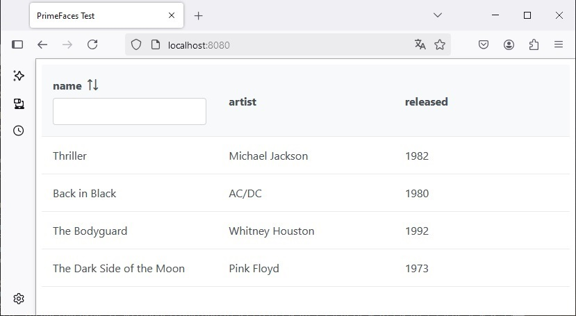
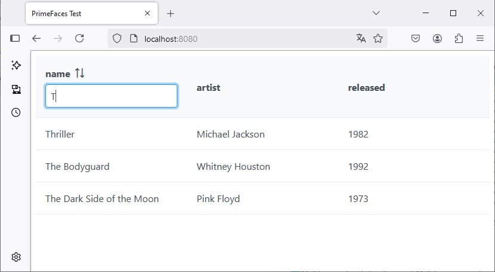

Demonstration of FilterMeta bug

Steps to reproduce:

1. Run console command `mvn clean jetty:run`

2. Open browser on http://localhost:8080/

3. Input letter "T" in the filter of column "name" and wait for results of filtering

4. Input yet any letters additionally in the filter of column "name" and wait for results of filtering

As can be noticed on step 4, after first non-empty filtering (on step 3) filtering is broken.
The reason is that changing of filter value does not change [hashcode](https://github.com/bvfalcon/PrimeFaces-FilterMeta-test/blob/ab37140803893293da38af389e26bb83698777ab/src/main/java/org/primefaces/test/TestTable.java#L53) of filter object.
